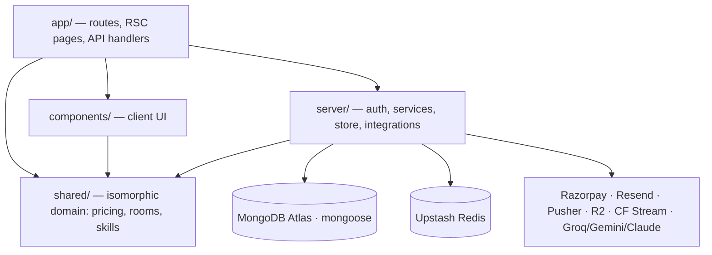

# Architecture and Code Structure

`Last reviewed: 2026-07-14`

The engineering reference for the unGhost codebase. Read this first when onboarding; pair it with the [runbooks](./09-runbooks) for on-call and [PRODUCT.md](../PRODUCT.md) for brand and copy rules.

> Naming note: the npm package (`noghost`) and a few file headers still carry the pre-rebrand name "NoGhost". The product, domain, and all user-facing copy are **unGhost**.

---

## 1. System overview

unGhost is an India-first hiring platform: recruiters commit to a public response SLA (24/48/72 h) or the student's application credit is refunded; bootcamps award Verified Skill badges recruiters can filter on. See [PRODUCT.md](../PRODUCT.md) for positioning and brand rules.

One Next.js 14 (App Router) monolith serves five user-facing modules plus the public marketing surface:

| Module | Routes | Who |
|---|---|---|
| Marketing | `/`, `/instructors`, `/bootcamps`, `/recruiters`, legal pages | Anonymous visitors |
| Student | `/dashboard`, `/student/*`, `/missions/[id]/*`, `/onboarding` | Job-seekers |
| Recruiter | `/recruiter/*`, `/company/team`, `/companies/[id]` | Hiring teams |
| Instructor | `/instructor/*` (studio, grading, live, recordings) | Bootcamp teachers |
| Admin | `/admin/*` (+ `/admin-login`) | Internal operators |
| Creator | `/creatordashboard/*`, `/p/[code]`, `/r/[code]` | Referral partners |

Scale: ~100 page routes, 128 API route handlers, 156 build outputs.



## 2. Tech stack

| Concern | Choice | Notes |
|---|---|---|
| Framework | Next.js 14.2 (App Router), React 18, TypeScript `strict` | Path alias `@/*` → repo root |
| Data | MongoDB (mongoose 9) + Upstash Redis | Migrations via `migrate-mongo` |
| Auth | NextAuth v4 — JWT sessions (30 d), Credentials + Google | Session-revocation epochs in Redis |
| Payments | Razorpay Standard Checkout via REST (`server/integrations/payments/razorpay.ts`) | No SDK; paise-denominated |
| AI | Groq → Gemini → Claude → deterministic mock (`server/integrations/ai/`) | Each provider chains down on failure |
| Client state | React Query + Zustand | |
| Styling / motion | Tailwind CSS, framer-motion, GSAP, Lenis smooth-scroll | Tokens in `tailwind.config.ts` + `app/globals.css` |
| Validation | Zod at every API boundary (`server/lib/validate.ts`) | |
| Logging | pino structured JSON (`server/lib/logger.ts`) | |
| Errors / APM | Sentry (client + server + edge configs at repo root) | Release = deploy commit SHA; `/monitoring` tunnel |
| Tests | Vitest (44 co-located suites) + Playwright (`tests/e2e/`) | |
| Deploy | Vercel, region `bom1`; 6 cron jobs in `vercel.json` | `Dockerfile`/`docker-compose.yml` for self-hosting |

## 3. Repository layout

```
app/                    # Next.js App Router: pages (RSC by default) + api/ handlers
components/             # Client components by feature: ui/, glass/, landing/,
                        #   courses/, student/, recruiter/, admin/, instructor/,
                        #   auth/, live/, shared/, …
server/                 # All backend logic (never imported by components/)
  auth/                 # NextAuth options, bcrypt passwords, reset + email-verify
                        #   tokens, session-epoch revocation, DPDP helpers
  creator/              # Referral-platform services (commission, ledger, payout,
                        #   referral, reward, event) — one service per concern
  db/                   # mongo.ts (connection), models.ts + creator-models.ts
                        #   (schemas), redis.ts, indexes.ts, migrations/, seeds/
  integrations/         # Adapters, one folder per vendor concern:
                        #   ai/ email/ payments/ queue/ realtime/ storage/ stream/
  lib/                  # Cross-cutting: api-error, validate, csrf, rate-limit,
                        #   cache, idempotency, logger, quota, sla, slack, matching
  payments/             # Domain pricing/fulfilment: pricing.ts, courses.ts,
                        #   subscription.ts
  store.ts              # Repository layer: every DB read/write (≈220 functions)
shared/                 # Isomorphic domain data + pure logic (client AND server):
                        #   rooms.ts, skills.ts, course-content.ts, instructors.ts,
                        #   lib/{pricing,courses,sla,cn,safe-redirect,safe-image-url}
middleware.ts           # Edge: x-request-id + session-revocation gate
scripts/                # Operational one-offs: seed*, backfill-*, create-admin, …
tests/e2e/              # Playwright specs + global-setup (seeds demo accounts)
migrations → server/db/migrations/   # migrate-mongo, timestamped filenames
docs/                   # This documentation set
```

## 4. Layering and dependency rules

Four layers, enforced by `eslint-plugin-boundaries` in `.eslintrc.json` — a violating import fails `npm run lint`:

| From | May import |
|---|---|
| `app` | `components`, `server`, `shared` |
| `components` | `components`, `shared` |
| `server` | `server`, `shared` |
| `shared` | `shared` |

Consequences:

- **Components never touch the database or vendor APIs.** Client code gets data via RSC props or API routes.
- **`server/` never imports UI.** It is runtime-agnostic backend code.
- **`shared/` is dependency-free domain logic** — safe in the browser, the edge runtime, and Node.

Typical read path: `app/student/jobs/page.tsx` (RSC) → `server/store.ts` → mongoose models in `server/db/models.ts`. Typical write path: client component → `app/api/jobs/route.ts` → `server/store.ts` (+ `server/lib/*` guards).

**Edge safety:** `middleware.ts` runs on the edge runtime and must not transitively import mongoose or NextAuth options. It only uses `next-auth/jwt` (`getToken`) and `server/auth/session-epoch.ts` (Upstash REST). Keep it that way.

## 5. API conventions

Every mutating handler in `app/api/**/route.ts` composes the same guard stack (see `app/api/jobs/route.ts` for the canonical example):

```ts
// example — the standard handler shape
export const POST = withApiErrorTracking(
  withRateLimit("jobs:create", async (req) => {
    requireSameOrigin(req);                       // CSRF (server/lib/csrf.ts)
    const session = await getServerSession(authOptions); // authn + role check
    const body = await parseBody(req, Schema);    // Zod (server/lib/validate.ts)
    // … call server/store.ts / services …
  }),
);
```

- **Errors** — `withApiErrorTracking` (`server/lib/api-error.ts`) is the single boundary: it logs once, reports to Sentry, propagates the request id, and returns a sanitized JSON envelope. Never leak stack traces from a handler.
- **Rate limiting** — `server/lib/with-rate-limit.ts` over Upstash; falls back to in-memory in dev.
- **Cron routes** — `app/api/cron/*` authenticate via `CRON_SECRET` (`server/lib/cron-auth.ts`) and are scheduled in `vercel.json`.
- **Idempotency** — payment fulfilment is deduplicated via the `ProcessedTxn` model and `server/lib/idempotency.ts`.

## 6. Data layer

- **Connection** — `server/db/mongo.ts` memoises one mongoose connection per process.
- **Schemas** — ~45 schemas across `server/db/models.ts` (core: `User`, `Job`, `Application`, `Bootcamp`, `Company`, `MessageThread`, `Notification`, `LiveSession`, `ProcessedTxn`, `AuditLog`, `Skill`) and `server/db/creator-models.ts` (creator/referral platform).
- **Repository** — `server/store.ts` is the only place queries live. Function-per-operation, `React.cache`-memoised within an RSC render. Swap providers by replacing bodies, keeping signatures.
- **Migrations** — `migrate-mongo` (config at `migrate-mongo-config.js`, files in `server/db/migrations/`, named `YYYYMMDDHHMMSS-description.js`). Run `npm run migrate:up` before deploying schema-dependent code; every migration ships a working `down`.
- **Redis** — `server/db/redis.ts`: Upstash REST client; with no env vars it transparently degrades to an in-memory shim so dev needs no Redis. Used for rate limits, caching (`server/lib/cache.ts`), and session-revocation epochs.

## 7. Auth and sessions

Defined in `server/auth/index.ts` (NextAuth):

- **Providers** — Credentials (bcryptjs hashes, `server/auth/password.ts`) and Google OAuth.
- **Sessions** — JWT strategy, 30-day maxAge, role claim (`student` / `recruiter` / `admin` / `instructor` / `creator`) drives per-layout guards.
- **Revocation** — `middleware.ts` compares each JWT's mint-epoch against the user's current epoch in Redis (`server/auth/session-epoch.ts`). Ban/suspend/password-reset bumps the epoch, invalidating live tokens instantly. Fails open so a Redis blip never locks users out.
- **Request correlation** — the same middleware attaches `x-request-id` to every request; logger and Sentry share it.
- **Flows** — email verification (`server/auth/email-verify-token.ts`), password reset (`server/auth/reset-token.ts`), account status gates (`server/auth/account-status.ts`), DPDP consent/export/delete (`server/auth/dpdp.ts`, `app/api/account/*`).

## 8. Payments

Razorpay Standard Web Checkout, implemented over raw REST (`server/integrations/payments/razorpay.ts` — no vendor SDK):

1. Client requests an order → `app/api/payments/razorpay/order` creates it server-side (amount computed in **paise** from `server/payments/pricing.ts`; 18 % GST logic lives there — never trust a client amount).
2. Browser opens checkout with the public `NEXT_PUBLIC_RAZORPAY_KEY_ID`.
3. Callback hits `app/api/payments/razorpay/verify` — HMAC signature check, buyer-matches-session check, captured-status check.
4. `app/api/payments/razorpay/webhook` independently confirms (signature-verified), so fulfilment survives a dropped callback.
5. Fulfilment (`server/payments/{courses,subscription}.ts`) is idempotent via `ProcessedTxn` — callback and webhook can both fire; plan downgrades and re-buys are rejected.

## 9. External integrations

All vendors sit behind `server/integrations/<concern>/`. The house rule: **empty env vars activate a mock adapter**, so a fresh clone runs with zero accounts (`server/integrations/status.ts` reports live/mock per integration).

| Concern | Adapter | Live when |
|---|---|---|
| AI | `ai/` — Groq (primary) → Gemini → Claude → deterministic mock; each catches failures and chains down | any provider key set |
| Email | `email/` — Resend REST | `RESEND_API_KEY` |
| Payments | `payments/razorpay.ts` | Razorpay keys |
| Realtime | `realtime/` — Pusher Channels (live-session chat, notifications) | Pusher keys |
| Storage | `storage/` — Cloudflare R2, presigned upload/download (`app/api/upload/presign`) | R2 keys |
| Live video | `stream/` — Cloudflare Stream signed playback | Stream keys |
| Background jobs | `queue/` — Inngest event send | `INNGEST_EVENT_KEY` |

### 9.1 Live sessions — two hosting modes

`LiveSession.sessionType` selects where a session runs; both modes share the
model, scheduling UI (`components/instructor/LiveScheduleClient.tsx`), status
lifecycle, and student cards.

- **`"unghost"`** (default) — streamed on-platform at `/live/[code]` via
  YouTube Live or Cloudflare Stream (the table row above).
- **`"external"`** — conducted on an external tool (Zoho Meet, Google Meet).
  The meeting link (`externalJoinUrl`) is a **server-only secret**: the schema
  marks it `select: false` (same class as `cfStreamKey`), the only reader is
  `getExternalJoinTarget()`, and the only egress is the 302 in
  `app/api/live/[id]/join/route.ts`. It never appears in RSC props, API
  bodies, the DOM, or logs — audit summaries record the meeting *host* only
  (`live_session.external_create` / `external_update` in `AuditLog`).
  Recordings are NOT auto-captured; the instructor posts the recording as a
  regular lesson through the bootcamp editor afterwards.

**Paid-content gate (one policy, three enforcement points):** `join`,
`playback-token`, and `video-token` all admit only the owning instructor, an
admin, or a student enrolled in the parent bootcamp (via
`profile.enrolledBootcamps`, never `registeredStudentIds`). Regression suite:
`tests/live-external-sessions.test.ts` +
`tests/live-playback-token-enrolment.test.ts` (includes a leak test that
greps every student-reachable payload for the secret).

## 10. Observability and security

- **Logs** — pino JSON only (`server/lib/logger.ts`); every line carries `app.version` (deploy SHA), `app.environment`, `app.region`, and the request id. Never log secrets/PII.
- **Sentry** — `sentry.{client,server,edge}.config.ts`. Client config drops non-actionable noise (network errors, browser-extension frames via `denyUrls`); server config strips cookies/auth headers in `beforeSend`. Source maps upload on Vercel builds (`SENTRY_AUTH_TOKEN`); events are tagged with the commit-SHA release. Ad-blocker-proof ingest via the `/monitoring` tunnel route.
- **Alerts** — `server/lib/slack.ts` posts operational alerts to `SLACK_WEBHOOK_ENGINEERING`.
- **Headers** — strict CSP, HSTS (prod only), `frame-ancestors 'none'` etc. centralised in `next.config.mjs`.
- **CSRF** — same-origin enforcement on mutating routes (`server/lib/csrf.ts`).
- **Health** — `app/api/health/route.ts` returns version/env/region for uptime checks.

Deeper dives: [11 — Security review](./11-security-review-report.md), [SECURITY_AUDIT.md](../SECURITY_AUDIT.md).

## 11. Frontend structure

- **`components/ui/`** — the primitive kit (Button, Badge, Card, inputs). Use these, not ad-hoc markup; `.btn`-style CSS classes in `app/globals.css` back the non-React surface.
- **`components/glass/`** — chrome: `GlassNavbar`, `Logo`.
- **Feature folders** — `landing/`, `courses/`, `student/`, `recruiter/`, `admin/`, `instructor/`, `auth/` (sign-in scene), `live/`, `shared/` (Navbar, providers). Components live with their feature, not by type.
- **Design tokens** — `tailwind.config.ts` + CSS vars in `app/globals.css`: `brand-*` (single blue accent), `neutral-*`, type scale `text-body-*` / `text-display-*`, `shadow-elev-*`. Use tokens, never raw hex values.
- **Motion** — framer-motion for component/scroll choreography, Lenis for smooth scroll, GSAP where imperative timelines are needed. Every animation must gate on `useReducedMotion()`/`prefers-reduced-motion` (house accessibility rule — see `components/landing/VoidReveal.tsx` for the reference pattern).
- **Server-first** — pages are RSCs; `"use client"` only where interactivity requires it. Below-fold landing sections are `next/dynamic`-loaded.

## 12. Testing

| Layer | Tool | Location | Run |
|---|---|---|---|
| Unit / integration | Vitest (44 suites) | co-located `*.test.ts` next to sources | `npm test` |
| E2E | Playwright (5 specs) | `tests/e2e/` | `npm run test:e2e` |
| Load | k6 | `tests/load/` | `npm run load:smoke` |

Playwright auto-starts a dev server on port **3100** (deliberately not 3000 — see `playwright.config.ts`) and its `tests/e2e/global-setup.ts` seeds demo accounts idempotently. Point `PLAYWRIGHT_BASE_URL` at a running server to skip auto-start. Current counts and the coverage roadmap live in [12 — Test coverage report](./12-test-coverage-report.md).

## 13. CI/CD and environments

- **CI** — `.github/workflows/ci.yml`: job 1 lint + typecheck + vitest; job 2 production build.
- **Deploy** — Vercel (project `un-ghost`, region `bom1`, Mumbai). `vercel.json` schedules six crons: `sla-sweep`, `subscription-sweep`, `saved-search-digest`, `inmail-refund-sweep`, `referral-session-sweep`, `reward-reconcile`.
- **Config** — everything via env vars; `.env.example` documents all groups (Core, Database, Redis, AI, Email, Realtime, Queue, R2, Stream, Observability, Slack, OAuth, Razorpay). Copy to `.env.local` for dev; empty vendor keys mean mocks, missing *required* prod config fails fast at boot (e.g. UNGHOST-6, the Upstash guard).
- **Secrets** — never committed; managed in Vercel env (`npm run vercel:env:ls`).

## 14. Conventions checklist

When adding a feature:

1. **Page** → `app/<module>/<route>/page.tsx`, RSC unless it needs interactivity; data via `server/store.ts`.
2. **API route** → compose the Section 5 guard stack; Zod-validate every input; add the route to rate-limit config.
3. **DB change** → schema in `server/db/models.ts`, queries in `server/store.ts` only, reversible migration in `server/db/migrations/`.
4. **Client component** → correct `components/<feature>/` folder; primitives from `components/ui/`; tokens, never raw hex; motion gated on reduced-motion.
5. **Cross-runtime logic** (pricing, SLA math, labels) → `shared/`.
6. **Tests** → co-located `*.test.ts` for logic; Playwright spec for user-visible flows.
7. **Naming** — `verbNoun()` functions, `is/has/should` booleans, `SCREAMING_SNAKE_CASE` constants, PascalCase components/types.
8. **Docs** — update the relevant `docs/*.md` in the same PR (see [docs/README.md](./README.md)).
