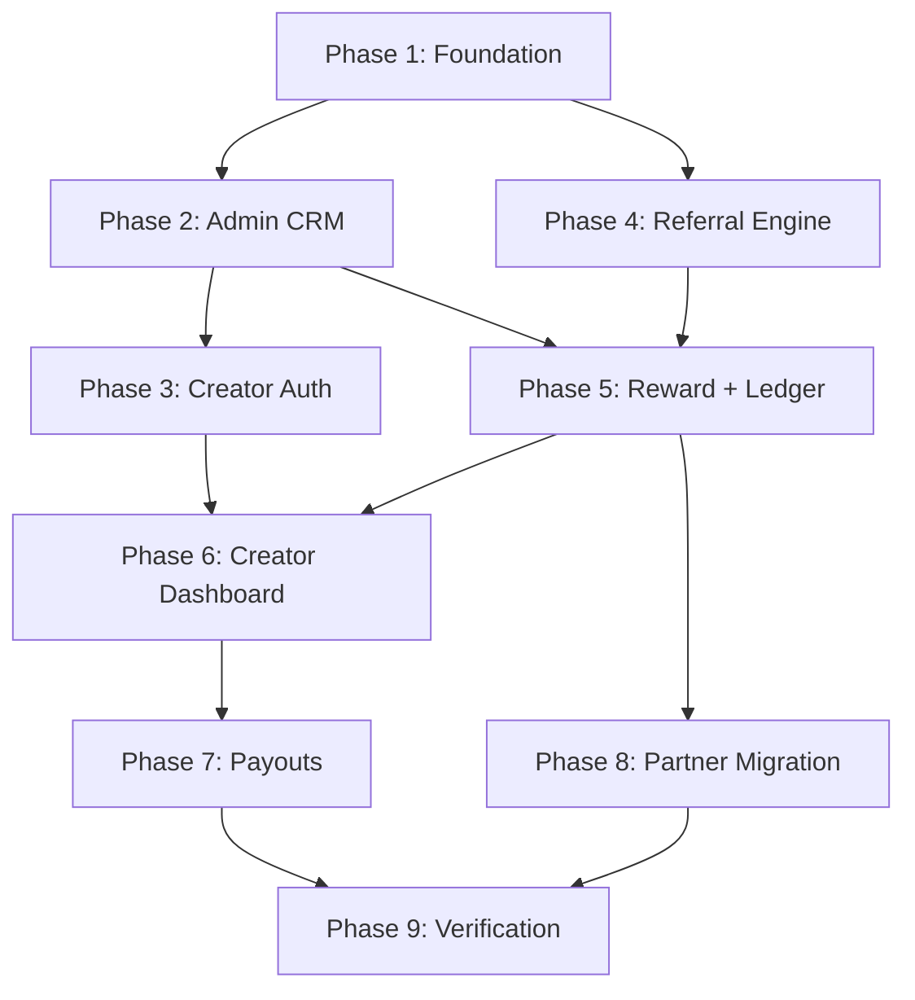

# unGhost Creator Platform — Step-by-Step Build Plan

> Source of truth for product philosophy: `docs/creator.md`.
> This document is the **build flow** — the exact order we implement, what each
> step delivers, and how it integrates with the existing codebase.

---

## 0. Ground Rules (from `docs/creator.md`)

These are non-negotiable. Every step below respects them.

1. One creator has one permanent, immutable referral identity.
2. Referral codes are never reused, even after a creator leaves.
3. One student belongs to exactly one creator. Attribution is permanent after signup.
4. **First valid attribution wins.**
5. Job products (₹149 / ₹299) NEVER generate rewards. Only Bootcamp/Premium (₹4,999) does.
6. Rewards require: verified payment **and** membership activation.
7. One payment creates at most one reward (idempotent).
8. Reward snapshots are immutable — historical rewards never change.
9. **Commission is negotiated per-creator.** No global rate. Admin sets each creator's rate.
10. Changing a commission creates a NEW agreement; the old one becomes historical.
11. Credit ledger is append-only. Balance is always derived, never stored.
12. Creator events are immutable (audit trail).
13. Dashboard owns NO business logic — presentation only.
14. Reuse existing auth, user model, payment flow, RBAC. Do not duplicate.
15. Creator dashboard lives at `unghost.in/creatordashboard` — not linked from the main platform UI.

---

## 1. Commission Model (Confirmed)

Commission is **per-creator, set by admin after negotiation, applied automatically**.

- Admin sets each creator's rate once during onboarding (editable later).
- Two agreement types:
  - **Percentage** — e.g. `15%` of the ₹4,999 base.
  - **Fixed** — e.g. `₹750` flat per sale.
- Commission base is the **pre-GST price (₹4,999)** — GST is a pass-through tax, not revenue.
- On each qualifying purchase, the system reads *that creator's* active agreement,
  computes the amount, and **snapshots the rate** into the reward (so later rate
  changes never alter past rewards).
- Changing a rate = create a new `active` agreement, mark the old one `superseded`.

---

## 2. Integration Map (Existing Code We Touch)

| Existing piece | Change |
|---|---|
| `shared/types/index.ts` → `Role` | Add `"creator"`. |
| `server/db/models.ts` → `UserModel` | Add `referredByCreatorId` (immutable), `referralSessionId`. |
| `app/api/auth/signup/route.ts` | Read referral cookie → attach creator attribution. |
| `server/payments/subscription.ts` → `fulfilPremiumPurchase` | After `firstTime` activation, call reward engine. |
| `middleware.ts` | Exempt `/r/[code]`; guard `/creatordashboard`. |
| `server/auth/index.ts` | No change — `authorize()` already accepts any role. |
| Existing `Partner` system | Migrate → Creator, then deprecate (Phase 7). |

New code lives under:
- `server/db/creator-models.ts` — 7 Mongoose schemas.
- `server/creator/*.service.ts` — service layer (business logic).
- `app/creatordashboard/*` — creator portal (presentation).
- `app/admin/creators/*` — admin CRM.
- `app/api/creator/*` and `app/api/admin/creators/*` — route handlers (thin).
- `app/r/[code]/route.ts` — public referral entry.

---

## 3. Data Model (7 New Collections)

### `creatorProfiles`
```
creatorId         (= User._id, role:"creator")
referralCode      unique, immutable, URL-safe slug
status            pending | active | suspended | terminated
socialLinks       { instagram?, youtube?, linkedin?, twitter? }
bio               string
invitedAt, acceptedAt, suspendedAt, suspendedReason, terminatedAt
createdByAdminId
```

### `commissionAgreements`
```
creatorId
type              "percentage" | "fixed"
value             number (percent 0-50 enforced, or fixed INR ≤ bootcamp base 4,999)
currency          "INR"
status            "active" | "superseded"
effectiveFrom, supersededAt
createdByAdminId, notes
```

### `referralSessions`
```
sessionToken      unique random hex (HttpOnly cookie value)
creatorId
landingPage, campaign
ipHash, userAgent
status            active | converted | expired
convertedAt, convertedUserId
expiresAt         (30 days)
createdAt
```

### `creatorRewards`
```
creatorId, userId
paymentId         unique  ← one reward per payment (idempotent)
orderId
// immutable snapshot:
commissionType, commissionValue, bootcampPrice (paise), calculatedAmount (paise), currency
status            pending | approved | rejected | reversed
reviewedByAdminId, reviewedAt
createdAt
```
State machine: `pending → approved | rejected`, `approved → reversed`. `reversed`/`rejected` are terminal. Reversal = a refund or chargeback after the reward already exists (see §10.1 9.2/9.3).

### `creditLedger` (append-only)
```
creatorId
type              "credit" | "debit"
amountPaise       positive; direction from type
currency
referenceType     "reward" | "payout" | "manual_adjustment" | "reward_reversal" | "refund" | "chargeback"
referenceId, description
createdAt, createdByActorId
```
Balance = `SUM(credit) − SUM(debit)` via aggregation. Never stored. May go **negative** after a post-payout reversal (a real debt) — future payouts are blocked until cleared; never auto-clawed (see §10.2 N1).

### `payoutRequests`
```
creatorId
amountPaise, currency
grossPaise, netPaise, tdsPaise (optional)   ← TDS recorded at payout; ledger debit = grossPaise (see §10.1 9.4)
status            requested | approved | processing | paid | rejected
paymentMethod     "bank_transfer" | "upi"
paymentReference
requestedAt, reviewedByAdminId, reviewedAt, paidAt, rejectedReason
```
Payout gate order (`processPayout`): payment details verified → amount ≥ `MIN_PAYOUT_PAISE` (default 50000) → amount ≤ available balance (see §10.2 N7).

### `creatorEvents` (immutable audit)
```
entityType        creator | agreement | reward | payout | referral_session
entityId
actorType         system | admin | webhook | creator | cron
actorId
eventType         e.g. "creator.invited", "reward.created", "payout.paid"
metadata          free-form
createdAt
```

---

## 4. Build Phases — Step by Step

Each phase is independently shippable and verifiable. Do them in order;
later phases depend on earlier ones.

---

### Phase 1 — Foundation

**Goal:** Schemas, types, role, event logging exist. Nothing user-facing yet.

1. Add `"creator"` to `Role` union in `shared/types/index.ts`.
2. Update `types/next-auth.d.ts` if needed (Role already flows through).
3. Create `server/creator/types.ts` — all creator-domain TypeScript types
   (Zod-validated where they cross boundaries).
4. Create `server/db/creator-models.ts` — all 7 Mongoose schemas with:
   - Unique index on `creatorProfiles.referralCode`.
   - Unique index on `creatorRewards.paymentId`.
   - Indexes on `creatorId` across all collections.
   - Index on `referralSessions.sessionToken` and `.status`.
5. Create `server/creator/event.service.ts` — `logCreatorEvent(...)`.
6. Add `User.referredByCreatorId` + `User.referralSessionId` to `UserModel`
   (indexed; immutable enforced in service layer).

**Verify:** schemas compile, indexes build, a unit test inserts + reads one of each model.

---

### Phase 2 — Admin Creator CRM

**Goal:** Admin can onboard a creator, set their commission, get a referral link.

1. `server/creator/creator.service.ts`:
   - `createCreator()` — creates User(role:creator, status:active, emailVerified:false)
     + CreatorProfile(status:pending) + first CommissionAgreement.
   - `getCreatorById()`, `listCreators()`, `searchCreators()`.
   - `suspendCreator()`, `terminateCreator()`, `reactivateCreator()`.
   - `generateReferralCode()` — unique, URL-safe, collision-checked.
2. `server/creator/commission.service.ts`:
   - `setCommissionAgreement()` — supersede old, create new active.
   - `getActiveAgreement(creatorId)`.
   - `listAgreementHistory(creatorId)`.
3. API routes (thin handlers, RBAC-gated to admin):
   - `POST /api/admin/creators` — create.
   - `GET /api/admin/creators` — list + search.
   - `GET/PATCH /api/admin/creators/[id]` — view / edit / suspend / terminate.
   - `POST /api/admin/creators/[id]/commission` — new agreement.
   - `POST /api/admin/creators/[id]/invite` — send/resend invitation email.
4. Admin UI: `app/admin/creators/page.tsx` + client component:
   - Table: name, code, status, active rate, total earned, link (copy button).
   - Create-creator modal (name, email, social links, commission type+value).
   - Per-creator detail: edit commission, suspend/terminate, view timeline.
5. Add "Creators" link to `components/admin/AdminSidebar`.
6. Every action logs a `creatorEvent`.

**Verify:** create a creator via UI → row appears with a referral link →
edit commission → old agreement superseded, new one active.

---

### Phase 3 — Creator Auth & Activation

**Goal:** An invited creator can set a password and log in.

1. Invitation email = reuse existing email-verify / reset-token machinery to
   issue a one-time "set password" link.
2. Set-password page (reuse existing reset-password flow or a creator variant):
   - On submit: set passwordHash, flip CreatorProfile.status → active,
     set acceptedAt, log `creator.activated`.
3. Login: creator uses existing `/login` (role tab "creator" or auto-detected).
   `authorize()` already handles any role — no change needed.
4. After login, creators are routed to `/creatordashboard` (add to `rolePath()`).

**Verify:** invite → click link → set password → log in → land on
`/creatordashboard` (even if empty for now).

---

### Phase 4 — Referral Engine

**Goal:** Clicking a link tracks a session; signing up attaches attribution permanently.

1. `server/creator/referral.service.ts`:
   - `createReferralSession()` — validate creator active, mint token, store session.
   - `attachAttribution(userId, sessionToken)` — first-touch wins, immutable.
   - `expireOldSessions()` — for the cron.
2. `app/r/[code]/route.ts` (public):
   - Lookup creator by code; if not active → redirect home silently.
   - Create referral session; set HttpOnly cookie `ug_ref=<token>`
     (30d, Secure, SameSite=Lax).
   - Capture `?campaign=` if present.
   - Redirect to homepage.
3. `middleware.ts`: add `/r/` to exempt paths (public, no revocation gate).
4. Modify `app/api/auth/signup/route.ts`:
   - Read `ug_ref` cookie.
   - If valid + active + unexpired session: set `User.referredByCreatorId`
     and `referralSessionId` (immutable), mark session converted,
     log `referral.converted`.
   - Keep existing `referrerCode` partner path working during migration window.
5. Cron `app/api/cron/referral-session-sweep/route.ts` — expire stale sessions daily.

**Verify:** open `/r/<code>` → cookie set → sign up → User has
`referredByCreatorId` → session marked converted. Second link click before
signup does NOT overwrite once attribution is set.

---

### Phase 5 — Reward Engine + Ledger

**Goal:** A qualifying purchase by an attributed student creates a pending reward + credit.

1. `server/creator/ledger.service.ts`:
   - `addLedgerEntry()` (append-only).
   - `getBalance(creatorId)` — aggregation: credits − debits.
   - `getLedgerHistory(creatorId)`.
2. `server/creator/reward.service.ts`:
   - `checkAndCreateReward({ userId, paymentId, orderId, amountPaise })`:
     - Lookup `User.referredByCreatorId`; none → return.
     - Creator must be active.
     - Get active agreement.
     - Reward for this `paymentId` exists? → skip (idempotent via unique index).
     - Compute commission (percentage of ₹4,999 base, or fixed).
     - Create reward (status:pending) + ledger credit + `reward.created` event.
   - `approveReward()`, `rejectReward()` — legal transitions only.
3. Define `REFERRAL_ELIGIBLE_PLANS` constant (e.g. `["premium"]`). Job access excluded.
4. Hook into `server/payments/subscription.ts`:
   - In `fulfilPremiumPurchase`, after `firstTime: true` activation,
     call `checkAndCreateReward(...)`. Best-effort, logged — never blocks fulfilment.
5. Admin reward review:
   - `GET /api/admin/rewards` (filter by status).
   - `POST /api/admin/rewards/[id]/approve` / `.../reject`.
   - Admin UI page `app/admin/rewards/page.tsx` — pending queue, approve/reject.

**Verify:** attributed student buys Premium → pending reward + credit appear →
admin approves → reward approved. Replay the same webhook → no duplicate reward.

---

### Phase 6 — Creator Dashboard

**Goal:** Creator sees earnings, rewards, campaigns, and can request payouts.

1. `app/creatordashboard/layout.tsx`:
   - Gate: `session.user.role === "creator"`, else redirect.
   - Own layout/nav, isolated from the main platform shell.
2. Creator API (thin, reads from services):
   - `GET /api/creator/dashboard` — balance, total earned, #referrals, recent rewards.
   - `GET /api/creator/rewards` — paginated.
   - `GET/POST /api/creator/campaigns` — list / create campaign link.
   - `GET /api/creator/settings`, `PATCH` social links/bio.
3. Pages:
   - `/creatordashboard` — summary cards + recent activity.
   - `/creatordashboard/rewards` — reward history.
   - `/creatordashboard/campaigns` — campaign links + per-campaign clicks/conversions.
   - `/creatordashboard/payouts` — balance, payout history, "Request payout".
   - `/creatordashboard/settings` — referral link, social links, profile.

**Verify:** creator logs in at `/creatordashboard` → sees correct balance
(matches ledger) and reward list. A non-creator hitting the URL is redirected.

---

### Phase 7 — Payouts

**Goal:** Creator requests payout; admin processes it; ledger reflects the debit.

1. `server/creator/payout.service.ts`:
   - `requestPayout()` — validate amount ≤ available balance; create request.
   - `approvePayout()`, `processPayout()` (mark paid + ledger debit), `rejectPayout()`.
2. Creator API: `POST /api/creator/payouts`, `GET /api/creator/payouts`.
3. Admin API: `GET /api/admin/payouts`, `POST /api/admin/payouts/[id]/process`,
   `.../reject`.
4. Admin UI: `app/admin/payouts/page.tsx` — queue, process with payment reference.
5. RBAC: restrict payout processing + reward approval to admin (super_admin/finance
   if sub-roles are introduced later).

**Verify:** creator with balance requests payout → admin processes with a
reference → ledger debit created → creator balance drops by the paid amount.
Requesting more than balance is rejected.

---

### Phase 8 — Partner Migration + Cleanup

**Goal:** Move the legacy Partner system into Creator; remove duplication.

1. Migration script `scripts/migrate-partners-to-creators.ts`:
   - For each `Partner` → create CreatorProfile (status mapped) +
     CommissionAgreement (from `commissionPct`).
   - Backfill: users with `referrerPartnerId` → set `referredByCreatorId`
     to the migrated creator (immutable, one-time).
2. Keep `referrerPartnerId` column for historical reference; stop writing to it.
3. Deprecate `/p/[code]` and `/admin/partners` once parity is confirmed.

**Verify:** migrated creators show correct historical attribution counts;
no user loses their original attribution.

---

### Phase 9 — Verification & Hardening

**Goal:** Prove correctness; lock in indexes and security.

Tests (the ones that can actually break):
- Reward idempotency — same payment processed twice → one reward.
- Ledger consistency — balance == derived sum after a sequence of entries.
- Illegal state transitions rejected (e.g. rejected → paid).
- Attribution permanence — second link can't overwrite first.
- Self-referral prevention — creator can't earn from their own purchase.
- Commission snapshot — changing agreement doesn't alter past rewards.
- Referral session expiry — sweep flips status, never deletes.
- RBAC — non-admin can't approve rewards / process payouts.

Hardening:
- Confirm all unique + query indexes are present (`server/db/indexes.ts`).
- HttpOnly + Secure + SameSite=Lax on the referral cookie.
- Zod validation on every route boundary.
- Transactions for reward+ledger writes where Mongo supports it.

---

## 5. UI/UX Design Direction

Two surfaces, two audiences, one brand. Both build on the editorial design
system in `@/components/ui` (`Card`, `Button`, `Stat`, `Modal`, `Drawer`,
`EmptyState`, `SectionLabel`, `TierBadge`, `Chip`, `Skeleton`, `ToastProvider`,
`AppNav`) — never the legacy `@/components/glass` atoms in new code. Brand
tokens (`brand-ink`, `brand-muted`, `brand-primary`), glass panels, Lucide
icons, and `Intl.NumberFormat("en-IN")` money formatting throughout.

### Shared principles
- **Clarity first.** Every screen is immediately understandable — labelled
  numbers, plain language, no jargon. If a creator or operator has to guess what
  a figure means, the screen has failed.
- **Money is never ambiguous.** Always `₹X,XXX` (en-IN), never raw paise. A
  displayed balance always equals the derived ledger balance.
- **Status honesty.** `pending` vs `approved` is always visible so no one is
  surprised about what they can withdraw.
- **Theming.** Build on light/dark theme tokens from day one; **ship light
  first**, turn dark on later with no component rewrites.
- **Utilitarian.** No celebration/confetti moments in this version — clean,
  fast, functional.
- **Copy-the-link is one tap**, with a toast confirmation, everywhere it appears.

### Surface 1 — Admin Creator CRM (`/admin/creators`)
Lives inside the existing admin shell (`AdminSidebar` + `BlobField`). Optimised
for an operator managing many creators: dense, clear, fast, never confusing.

- **Roster page:** 4 KPI cards (Active creators · Total paid out · Pending
  rewards · Attributed revenue) over a searchable, status-filtered table
  (`Creator · Code · Status · Active rate · Lifetime earned · Balance · Copy link`).
- **Onboard-creator modal:** name, email, social links, and a commission setter
  (segmented `Percentage | Fixed` + one number field) with a **live preview** —
  "On a ₹4,999 sale, this creator earns ₹749." The preview is the anti-mistake
  guardrail. Submit → toast with the copyable referral link.
- **Creator detail:** referral link, current commission + "Change commission"
  (shows agreement history), and tabs for Rewards · Ledger · Timeline · Settings.
  Lifecycle actions: Suspend / Terminate / Reactivate.
- **Rewards queue (`/admin/rewards`):** pending worklist, inline approve/reject,
  bulk-approve.
- **Payouts queue (`/admin/payouts`):** requested payouts, process with a payment
  reference.

### Surface 2 — Creator Dashboard (`/creatordashboard`)
Isolated shell — its own clean layout, no admin sidebar, no main-platform nav.
Brand-consistent. **Mobile-first** (creators check earnings on their phone
between posts): big tap targets, bottom tab bar on small screens, balance
legible at a glance. Clean and self-explanatory for a non-technical partner.

- **Home:** balance hero with "Request payout", three `Stat` cards (Lifetime ·
  Pending · Referrals), the referral link with copy, and a recent-earnings list
  (each row shows ✓ approved / ⏳ pending).
- **Rewards:** full earnings history with clear per-row status.
- **Campaigns:** the permanent link plus a campaign builder — type a name, get
  `…/r/<code>?campaign=<name>`, copy it, and see per-campaign clicks → signups →
  sales.
- **Payouts:** balance, "Request payout", history with a `requested → processing
  → paid` stepper.
- **Settings:** profile, social links, and **self-entered payment details**
  (bank / UPI) used for payouts.
- **Empty states teach:** a creator with zero earnings sees "Share your link to
  start earning" with the copy button right there (`EmptyState`).

---

## 6. Dependency Order (Visual)



---

## 7. Confirmed Decisions

| Question | Decision |
|---|---|
| Commission base | Pre-GST ₹4,999 |
| Reward on creation | `pending`; ledger credit added immediately so creator sees it |
| Minimum payout | **₹500 default (`MIN_PAYOUT_PAISE`, configurable).** Provider floor is ₹1. — *amended §10.4* |
| Refunds / chargebacks (creator ledger) | Customer policy stays "all sales final". But when the platform issues a refund (`/api/admin/billing/refund`) or a bank forces a chargeback, the linked reward flips to `reversed` and an offsetting ledger debit is written. Adds `reversed` reward state + `refund`/`chargeback` ledger types. — *amended §10.4* |
| Self-referral | Blocked (creator's own purchase earns nothing) |
| Partner system | Migrate + deprecate |
| Eligible products | Premium (₹4,999) only; Job Access never |
| Creator dashboard aesthetic | Consistent with unGhost brand (editorial `@/components/ui`) |
| Theming | Light + dark; **ship light first**, dark later (built on theme tokens) |
| Creator payment details | Creators enter their own bank / UPI in settings; **admin-verified before first payout** (`paymentDetails.verified`). Automated KYC is later scope. — *amended §10.4* |
| TDS | Automated 26Q/Form-16A **deferred**; payout schema is TDS-ready (`grossPaise`/`tdsPaise`/`netPaise`), admin enters TDS manually at payout. — *amended §10.4* |
| Delight | Strictly utilitarian for now — no celebration moments |

---

## 8. Definition of Done

- Admin can onboard a creator with an individually negotiated commission.
- Creator gets a permanent referral link and a working `/creatordashboard` login.
- A click sets a session; a signup attaches attribution permanently.
- An attributed student's ₹4,999 purchase creates exactly one pending reward
  with a frozen commission snapshot + a credit ledger entry.
- Admin approves/rejects rewards.
- Creator requests payouts; admin processes them; ledger stays append-only and
  balance is always derived.
- Legacy partners migrated; no attribution lost.
- All correctness tests pass; indexes + security in place.

---

## 9. Loopholes Found

Identified gaps in the above plan that need resolution before or during implementation.

### 9.1 Self-Referral Enforcement Unspecified

Ground rule #17 says self-referral is "Blocked" and Phase 9 tests mention prevention, but no mechanism is described. There is no check in `checkAndCreateReward()` comparing the purchaser's identity to the creator's identity. A creator could refer themselves via an alternate email and earn commission on their own purchase.

**Fix needed:** Add `purchaserId !== creatorId` guard in the reward engine before computing commission.

### 9.2 No Refund / Chargeback Handling

The plan declares "no refund policy on the platform" as a business decision, but payment processors (Razorpay/Stripe) can force chargebacks regardless. If a payment is reversed externally, the reward and ledger credit persist with no reversal mechanism — the creator would be paid for a reversed purchase.

**Fix needed:** Add a `chargeback` or `reversed` reward state and a corresponding ledger debit type. Payment webhook handlers should listen for chargeback events.

### 9.3 Reward Rejection Leaves Orphaned Ledger Credit

Phase 5 creates the ledger credit immediately when reward is created (`pending`). If the reward is later `rejected`, there is no automatic debit or offset — only `manual_adjustment` exists as a reference type. Balance can be inflated until an admin manually corrects it.

**Fix needed:** On reward rejection, automatically create a debit ledger entry referencing the rejected reward.

### 9.4 No TDS / Tax Compliance

The plan operates in INR (India) but does not mention TDS deduction, tax withholding thresholds, or Form 16/26Q reporting. This is a legal/compliance gap.

**Fix needed:** Add TDS deduction logic at payout time, configurable by admin. Generate tax reports.

### 9.5 No Commission Cap

`commissionAgreements.value` allows 0–100% with no guardrail. An admin could accidentally set 100%, making every ₹4,999 sale pay ₹4,999 to the creator with ₹0 for the platform.

**Fix needed:** Enforce a maximum commission percentage (e.g. 50%) at the schema and service layer.

### 9.6 Creator Payment Details Unverified

Creators enter their own bank/UPI details in settings with no KYC or account validation before the first payout. Failed transfers and reconciliation issues are likely.

**Fix needed:** Validate bank account / UPI ID via an identity verification service before allowing payouts. Add a `verified` field to payment details.

### 9.7 Race Condition in Reward Creation

`checkAndCreateReward()` is described as "check if exists → skip; else create." Without atomic transactions (deferred to Phase 9), two concurrent webhook calls for the same payment could both pass the existence check. The unique index prevents duplicates but throws an error rather than gracefully skipping.

**Fix needed:** Use `tryInsert` (unique index + error handling) instead of check-then-insert, or use MongoDB transactions from day one.

### 9.8 No Minimum Payout Floor

Plan explicitly says "any amount, even ₹1, is payable." Bank transfer and UPI transaction fees will exceed the payout amount on micro-payouts, making this uneconomical at scale.

**Fix needed:** Add a configurable minimum payout threshold (e.g. ₹100).

### 9.9 Creator Inactivation Between Signup and Purchase

If a creator is suspended/terminated after a student signs up but before they purchase (potentially months later), the reward is blocked by the "Creator must be active" check. The attribution is permanent — the student still belongs to them — but the creator gets ₹0.

**Fix needed:** Decide whether rewards should still accrue for attributed students even if the creator is later suspended (i.e. only check creator was *active at time of referral*, not at time of purchase).

### 9.10 Referral Session Expiry Race

A user clicks a link at day 29, a session is created with 30-day TTL, but the cron sweeps sessions daily. If the cron runs and marks the session `expired` before the user signs up (even though the cookie is still valid client-side), the referral is silently lost. No retry or grace period exists.

**Fix needed:** Use the cookie itself as the source of truth for expiry (check cookie TTL server-side rather than relying solely on the cron-marked `status`), or add a 48-hour grace window after expiry.

---

## 10. Loophole Resolution Plan

Every item in §9 was re-checked against the actual codebase before writing a
fix. Verdicts are grounded in real files, not the plan's own prose. **All 10
are legit.** Two of them (refunds, minimum payout) are not just gaps — they
directly contradict the "Confirmed Decisions" in §7 and the ground rules in §0,
because those decisions were written against a premise ("no refunds on the
platform") that the existing code disproves.

### 10.0 Legitimacy Verdicts (grounded in code)

| # | Loophole | Verdict | Grounding evidence |
|---|---|---|---|
| 9.1 | Self-referral unspecified | **Legit** | No identity check anywhere in the plan's `checkAndCreateReward()`. |
| 9.2 | No refund / chargeback handling | **Legit — premise is false** | `app/api/admin/billing/refund/route.ts` (admin can refund + revoke plan), `server/integrations/payments/refundPayment` (PhonePe), and `app/refund-policy/page.tsx` has a live **"Disputed charges + chargebacks"** section. Refunds and chargebacks both already happen. |
| 9.3 | Reject leaves orphaned ledger credit | **Legit** | §5 + §7 both say the credit is written at `pending`; nothing offsets it on `reject`. |
| 9.4 | No TDS / tax compliance | **Legit, scope-gated** | Commission payouts in India trigger TDS u/s 194H. Real legal item, but heavy; not a code bug. |
| 9.5 | No commission cap | **Legit — a regression** | Existing Partner system caps at `z.number().min(0).max(50)` (`app/api/admin/partners/route.ts`). New plan allows 0–100. |
| 9.6 | Payment details unverified | **Legit, scope-gated** | No KYC/verify step before payout; failed transfers likely. |
| 9.7 | Reward-creation race | **Legit** | The codebase's own idempotency pattern is upsert `$setOnInsert` (`recordProcessedTxn`, `server/db/models.ts:1039`), not the plan's check-then-insert. |
| 9.8 | No minimum payout floor | **Legit — contradicts §7** | §7 says "None — any amount, even ₹1". Transfer fees make micro-payouts loss-making. |
| 9.9 | Creator inactivated before purchase | **Legit, needs a decision** | "Creator must be active" in `checkAndCreateReward()` silently zeroes a permanently-attributed sale. |
| 9.10 | Referral session expiry race | **Legit** | Plan gates signup attribution on cron-set `status: active`; the cron can flip it while the cookie is still valid. |

### 10.1 Resolutions

Format per item — **Fix · Where · Conflict (if any)**. "Where" names the exact
symbol/file the change lands in.

**9.1 — Self-referral.** Add a guard in `reward.service.ts → checkAndCreateReward()`:
if `user.referredByCreatorId === purchaserUserId` (the creator's `creatorId` **is**
their `User._id` per §3), skip with a `reward.skipped_self_referral` event.
Residual risk: a creator buying via a *different* email is a separate account
(different `_id`) and cannot be caught by an id compare — that is a fraud/KYC
problem, **out of scope**. Mitigate with the audit trail (`creatorEvents`) +
admin review of suspiciously fast self-conversions, not code.
· Where: `server/creator/reward.service.ts`. · No conflict.

**9.2 — Refund / chargeback reversal.** This is the load-bearing fix. Introduce a
single idempotent `reverseReward({ paymentId, reason, kind })` in
`reward.service.ts`:
- Find the reward by its unique `paymentId`. None → no-op (reward may never have
  existed; safe).
- If already reversed → no-op (idempotent; webhooks are at-least-once).
- Set reward `status: reversed`, write an **append-only debit** to
  `creditLedger` (`type: "debit"`, `referenceType: "chargeback" | "refund"`,
  `referenceId: rewardId`) equal to the original `calculatedAmount`.
Hook it into **both** reversal sources:
- `app/api/admin/billing/refund/route.ts` — after `refundPayment` succeeds, call
  `reverseReward({ paymentId: <maps to originalTxnId>, kind: "refund" })`.
- `app/api/payments/razorpay/webhook/route.ts` and the PhonePe webhook — handle
  the dispute/refund events (`payment.dispute.created`, `refund.created`/
  `refund.processed` for Razorpay; the PhonePe refund callback) and call
  `reverseReward({ kind: "chargeback" })`.
· Where: `reward.service.ts`, `ledger.service.ts`, both webhook routes, the admin
refund route. · **Conflict:** §0 rule set + §7 say "no reversal flow, no
`reversed` reward state, no reversal ledger type." Those must be amended (see
§10.3). The refund-policy page can keep saying "all sales final" to customers —
that is the *customer* policy; this fix is the *creator-ledger* correction for
the refunds that the platform itself issues and the chargebacks banks force.

**9.3 — Reject offsets credit.** Fold into the same primitive as 9.2: rejecting a
`pending` reward is just `reverseReward(..., kind: "rejected")` — set status
`rejected`, write the offsetting debit (`referenceType: "reward_reversal"`).
Removes the orphaned-credit window entirely; one code path handles reject,
refund, and chargeback. · Where: `reward.service.ts → rejectReward()`. · No new
conflict beyond 9.2's.

**9.4 — TDS.** Recommend **defer automated TDS** (no 26Q/Form-16A generation in
v1) but make the ledger TDS-ready so we never have to backfill: payouts store
`grossPaise`, optional `tdsPaise`, and `netPaise`; admin enters TDS manually at
`processPayout` time; the ledger debit equals `grossPaise` (the creator's earning),
TDS is recorded as metadata on the payout, not a separate ledger type. Automated
filing is a later, explicitly-scoped project. · **Sign-off needed** (legal).

**9.5 — Commission cap.** Enforce in Zod **and** service: percentage `0 ≤ v ≤ 50`
(match the existing Partner cap — do not introduce a second convention); fixed
`0 < v ≤ bootcampPrice` (₹4,999) so a fixed agreement can never exceed the base.
Reject at `setCommissionAgreement()` and at the schema. · Where:
`commission.service.ts`, `creator-models.ts`. · No conflict.

**9.6 — Payout details verification.** v1 = **manual admin verification**, not an
external KYC integration. Add `paymentDetails.verified: boolean` +
`verifiedByAdminId` + `verifiedAt`; `processPayout()` refuses to pay an
unverified creator. Automated penny-drop / VPA validation is a later scoped item.
· Where: `creator-models.ts` (profile/payout), `payout.service.ts`. · No conflict.

**9.7 — Reward race.** Replace check-then-insert with the codebase's existing
upsert idiom: `findOneAndUpdate({ paymentId }, { $setOnInsert: reward }, { upsert: true })`
(or `create()` + catch `E11000` and treat as "already created"). The unique
`paymentId` index already exists (§3 / Phase 1) — this just stops it from
throwing on the legitimate concurrent-webhook race. The ledger credit is written
only on the branch that actually inserted the reward. · Where:
`reward.service.ts`. · No conflict.

**9.8 — Minimum payout floor.** Recommend a configurable `MIN_PAYOUT_PAISE`
(default **₹500 = 50000 paise**), enforced in `requestPayout()`. · **Conflict:**
§7 explicitly says "None — any amount, even ₹1." This needs a business reversal.
**Sign-off needed.** (Provider floor is anyway ₹1 = 100 paise.)

**9.9 — Inactive-at-purchase.** Decision rule: distinguish **suspended**
(temporary) from **terminated** (permanent). A purchase by a permanently-attributed
student:
- Creator `terminated` → **no reward** (they left; we keep nothing pending for
  them). Log `reward.skipped_creator_terminated`.
- Creator `suspended` → **still accrue** the reward as `pending` (attribution is
  permanent), but it is **not approvable** until the creator is reactivated.
So `checkAndCreateReward()` checks `status !== "terminated"` instead of
`status === "active"`. · Where: `reward.service.ts`. · **Sign-off needed**
(confirms the suspended-still-earns rule).

**9.10 — Session expiry race.** Make the **session record's `expiresAt` the single
source of truth**, not the cron-set `status`. At signup, attribution is valid iff
a session exists for the cookie token, is not already `converted`, and
`expiresAt > now` — regardless of whether the daily sweep has flipped `status`
to `expired`. The cron stays as pure housekeeping (it only ever flips status /
never deletes, per Phase 9), so a swept-but-still-valid session still converts.
· Where: `referral.service.ts → attachAttribution()`, `app/api/auth/signup/route.ts`.
· No conflict.

---

### 10.2 Second-Pass Self-Critique (issues the fixes themselves introduce)

Re-analyzing §10.1 as a reviewer surfaced follow-on problems. Each is folded
back into the resolution above or captured as a new requirement.

- **N1 — Reversal after payout → negative balance.** A chargeback can land after
  the creator already withdrew the money. Decision: the append-only ledger is
  allowed to go **negative** (it represents a real debt); `getBalance()` may
  return a negative number; `requestPayout()` already blocks `amount > balance`,
  so a negative balance simply blocks all future payouts until cleared. **Never**
  auto-claw from a bank account. Surface negative balances in the admin CRM as a
  "creator owes" state. → folds into 9.2.
- **N2 — Ledger `referenceType` enum is too small.** §3 lists only
  `reward | payout | manual_adjustment`. The reversal fixes need
  `reward_reversal` (reject), `refund`, and `chargeback`. → schema amendment §10.3.
- **N3 — Reversal idempotency at the ledger layer.** Webhooks fire more than once;
  `reverseReward` must be idempotent on its own. Guard with a unique compound
  index on `creditLedger (referenceType, referenceId)` for reversal rows, OR
  short-circuit when the reward is already in a terminal reversed/rejected state
  (cheaper, chosen). → folds into 9.2.
- **N4 — Id mapping between refund route and reward.** The reward is keyed by
  `paymentId`; the admin refund route (`/api/admin/billing/refund`) takes
  `originalTxnId`. These MUST be the same value the reward was created with
  (the provider payment id passed to `fulfilPremiumPurchase`). Verify the mapping
  before wiring — if they differ, `reverseReward` needs to accept the txn id and
  resolve the reward via the `orderId`/txn it stored. → new verification task,
  Phase 5.
- **N5 — Unify reject + reverse.** 9.3 and 9.2 are the same operation (set a
  terminal status + write one offsetting debit). Implement once as
  `reverseReward(kind)`; do not write two near-identical code paths. → already
  reflected in 9.3.
- **N6 — Best-effort reward hook can silently drop a creator's earning.** Phase 5
  says the reward hook is "best-effort, never blocks fulfilment." If it throws,
  the student is attributed and paid but the creator gets nothing and nobody
  notices. Add a **reconciliation cron** that scans `premium` `ProcessedTxn` rows
  whose `userId` has a `referredByCreatorId` but no `creatorReward` and creates
  the missing reward idempotently (the 9.7 upsert makes this safe to re-run).
  Mirrors the existing sweep-cron pattern (`inmail-refund-sweep`). → new task,
  Phase 5 / Phase 9.
- **N7 — Payout gate ordering.** `processPayout()` now has three gates (verified,
  ≥ floor, ≤ balance). Fix order: **verified → amount ≥ MIN_PAYOUT_PAISE →
  amount ≤ available balance**, each with a distinct typed error. → folds into
  9.6/9.8.
- **N8 — Reward state machine widened.** §3 says `pending → approved | rejected.
  No reversal.` It must become `pending → approved | rejected`, and
  `approved → reversed` (refund/chargeback after approval/payout). Illegal
  transitions (e.g. `rejected → approved`, `reversed → approved`) stay rejected
  and get a Phase 9 test. → schema amendment §10.3.

---

### 10.3 Required Amendments to the Existing Plan

These edits to earlier sections are prerequisites — the fixes are incoherent
without them. (Listed here; applied to §0/§3/§7 only after sign-off on the
business-decision items below.)

1. **§3 `creatorRewards`** — add `reversed` to the status enum. State machine
   becomes `pending → approved | rejected`, `approved → reversed`.
2. **§3 `creditLedger.referenceType`** — extend to
   `reward | payout | manual_adjustment | reward_reversal | refund | chargeback`.
3. **§3 `payoutRequests`** — add `grossPaise`, `tdsPaise?`, `netPaise`; add
   `paymentDetailsVerified` (or move verification onto the profile's
   `paymentDetails`).
4. **§3 `commissionAgreements`** — document the enforced caps (pct ≤ 50, fixed ≤
   bootcamp base).
5. **§7 Confirmed Decisions** — reverse two rows: "Refunds" (now: external
   refunds/chargebacks trigger a creator-ledger reversal; customer policy
   unchanged) and "Minimum payout" (now: ₹500 default, configurable). Pending
   sign-off.
6. **§4 Phase 5** — add: reverseReward primitive, webhook chargeback handlers,
   reconciliation cron, upsert-based idempotent reward creation.
7. **§4 Phase 9** — add tests: reversal idempotency, negative-balance handling,
   refund→reversal, chargeback→reversal, self-referral, suspended-vs-terminated
   accrual, commission cap, payout floor, session expiry by `expiresAt`.

### 10.4 Items Requiring Business Sign-Off (do not start until resolved)

| Item | Recommended default | Why it needs a human |
|---|---|---|
| 9.2/9.3 reversal model | Adopt `reversed` state + reversal debits | Reverses §0/§7 "no reversal" — a stated decision. |
| 9.4 TDS | Defer automation; ledger TDS-ready; manual at payout | Legal/finance call. |
| 9.8 minimum payout | ₹500, configurable | Directly contradicts §7 "any amount". |
| 9.9 suspended accrual | Suspended still accrues (pending); terminated does not | Confirms intended fairness rule. |
| 9.6 KYC depth | Manual admin verification in v1 | Confirms automated KYC is later scope. |

### 10.5 Solidified Resolution — Definition of Done

The loophole plan is **complete and ready to build** once:
- §10.1 fixes 9.1, 9.5, 9.7, 9.10 are implemented (no sign-off needed — pure
  correctness, no decision reversal).
- §10.4 sign-off items are confirmed, then §10.3 amendments are applied to
  §0/§3/§7, then 9.2/9.3/9.4/9.6/9.8/9.9 are implemented per the agreed defaults.
- Every fix has a Phase 9 test from §10.3.7, and the reversal path is proven
  idempotent under a replayed refund/chargeback webhook.

**Status: APPROVED 2026-06-26 — all five §10.4 sign-offs confirmed; §10.3
amendments applied to §3 and §7 (the "no reversal" rule lived in §7, not §0).
Implementation underway, building in phase order with loophole fixes baked in.**
